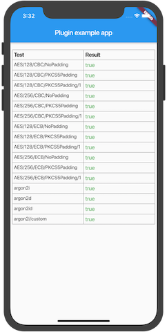

# encryptions
[](https://pub.dev/packages/encryptions)

A plugin for using native AES /Argon2 algorithms in Android/IOS. Since it's not possible to run automatic test for flutter plugins currently as far as I know, a few test cases are provided along with the example:



Tested platforms:

* IOS simulator(IPhone 5SE)
* Android (NX563J, Android 10)

## Getting Started

Supported algorithms:

* AES(128bit or 256bit) in ECB or CBC mode,  with NoPadding or PKCS5Padding. Please be aware that if you choose `NoPadding` then you need to make sure the size of the block you're going to encrypt must be multiple of 16(which is the AES block size).
* argon2i, argon2d, argon2id

### AES example usage

```dart
Uint8List key256 = hex
    .decode("163928fb9615edf6005afc98d9fdbb3d830b3a286ebef64dd70be848f17bf9cc");
Uint8List iv = hex.decode("c1f6fd873e14050697c168b3e9da5db2");
Uint8List plain = hex.decode("01040000000300000002400000008b2e");

AES aes = AES.ofCBC(key256, iv, PaddingScheme.PKCS5Padding);
Uint8List encrypted = await aes.encrypt(plain);
Uint8List decrypted = await aes.decrypt(encrypted);
```

### Argon2 example usage

```dart
Uint8List password = utf8.encode("password");
Uint8List salt = utf8.encode("helloworld");

Argon2 argon2 = Argon2(iterations: 16, hashLength: 64, memory: 256, parallelism: 2);
Uint8List hash = await argon2.argon2i(password, salt);
```

for more details, try to have a look at `example/lib/test_case.dart`
